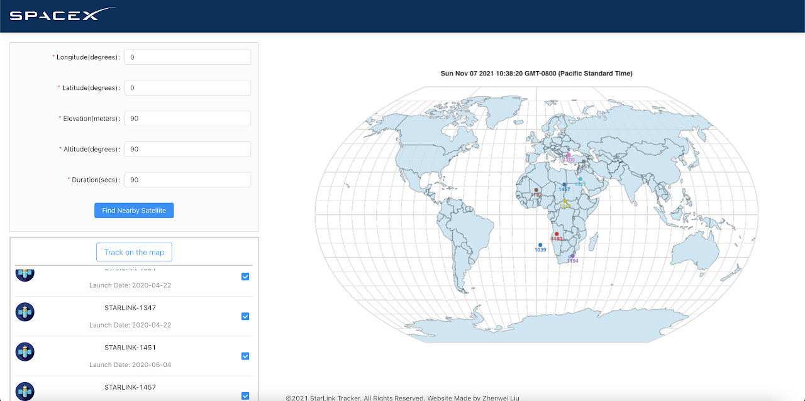

# Zhenwei's personal project

**Background**
This is a personal project that allows people to track Starlink's satellites and draw their trajectories. Starlink is a satellite internet constellation being developed by SpaceX that aims to provide global high-speed internet access. With this project, user can visualize the orbits of these satellites in real-time and track their movements as they orbit the Earth.

**Running our code**

STEPS TO RUN:
- (1) Open terminal and Clone/Download our repository 
```
git clone https://github.com/williamliuzhenwei/starlink.git
```
- (2) ```npm install```  to install all necessary packages
- (3) ```npm start``` to start the project


**Major Third-party libraries**
- **Drawing**
  - topojson: https://github.com/topojson/topojson-client
    - ```npm install --save topojson-client```
  - d3-geo https://github.com/d3/d3-geo
    - ```npm install --save d3-geo```
  - d3-scale-chromatic https://github.com/d3/d3-geo-projection
    - ```npm install --save d3-geo-projection```
  - d3-scale-chromatic https://github.com/d3/d3-selection
    - ```npm install --save d3-selection```
  - d3-time-format https://github.com/d3/d3-time-format
    - ```npm install --save d3-time-format```
  - d3-scale http://github.com/d3/d3-scale
    - ```npm install --save d3-scale```
  - d3-scale-chromatic https://github.com/d3/d3-scale-cheomatic
    - ```npm install --save d3-scale-chromatic```
  
**API**
Register on N2Yo: https://www.n2yo.com/login/register, then visit profile page to access the button that generates the API Key.

**Sample screenshot of webapp**
<br>
